# Developing Vue.js UI with Azure AD authentication (using MSAL) communicating with NodeJS back end

  This sample shows you how to create a univseral authentication with Azure. The token is then used by the auth interceptor every time it needs to talk to back-end service.
  We are showing capabilities how to talk to multiple back-end services written in different languages that communicate with different Azure services.
  These back-end services are itself REST API complaint services. Source code to those services are available.
   
  Each button in the UI talks to different REST end points.

   1. Product - Communicates with Azure SQL DB using Node.js

   1. File - Communicates with Azure blob storage using Node.js

   1. School - Communicates with Azure Cosmos DB using Node.js

Link to the working Vue.js UI
https://vuejs-2-nodejs.azurewebsites.net/

# Azure Active Directory (App registration)

This application does external Authentication with Azure AD. Use Azure Active Directory to create App registration. Use the following steps to get app registration details.
## Step 1: Create new app registration

1. In the Azure Portal, select **Azure Active Directory**

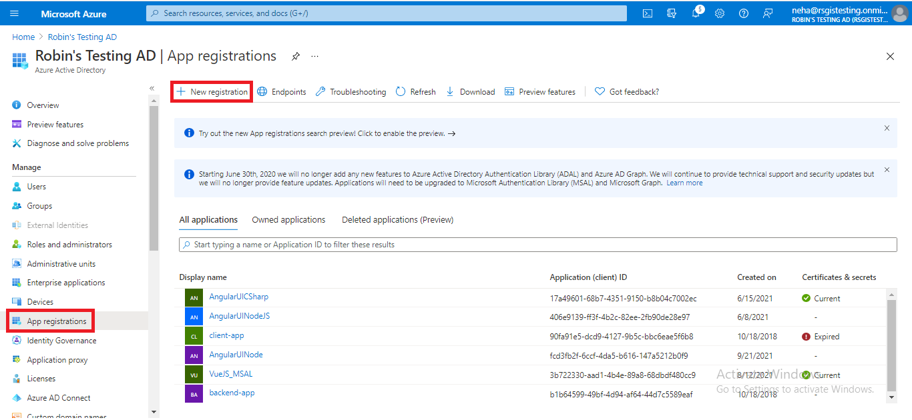
&nbsp;

2. Click on the **App registrations** button then click on **New registration**

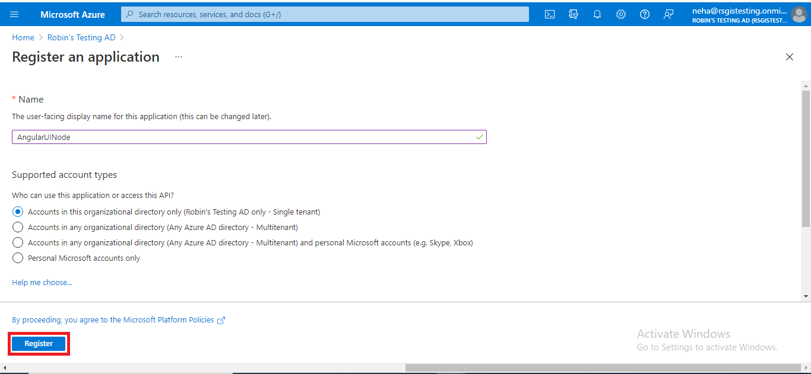 
&nbsp;

3. Fill out the **Form** inputs as follows:
- **Name:** Enter a display Name for your application
- Specify who can use the application

## Step 2: Configure platform settings

1. Under Manage, select **Authentication**
2. Under Platform configurations, select **Add a platform**
3. Under Configure platforms, select the **Web platform** for your application

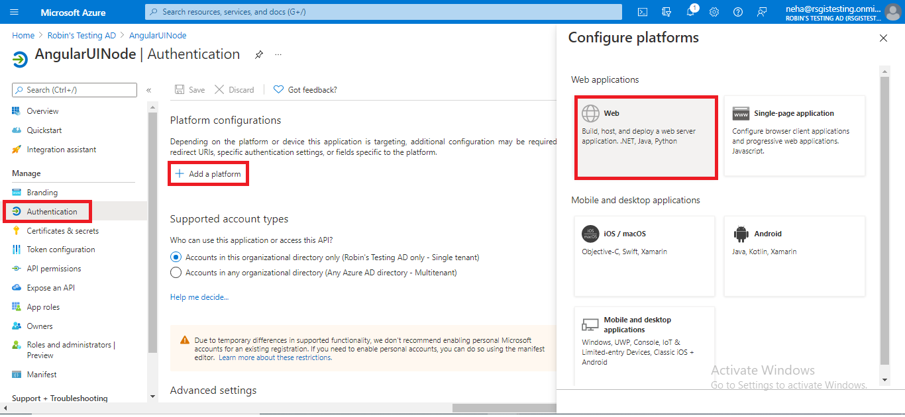 
&nbsp;

4. Add **redirect URL**, select both **access token** and **ID token**

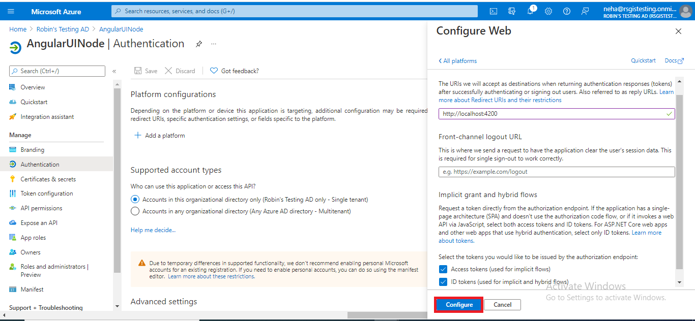
&nbsp;

5. Click on configure

## Step 3: Add app roles

1. Under Manage, select **App Roles**

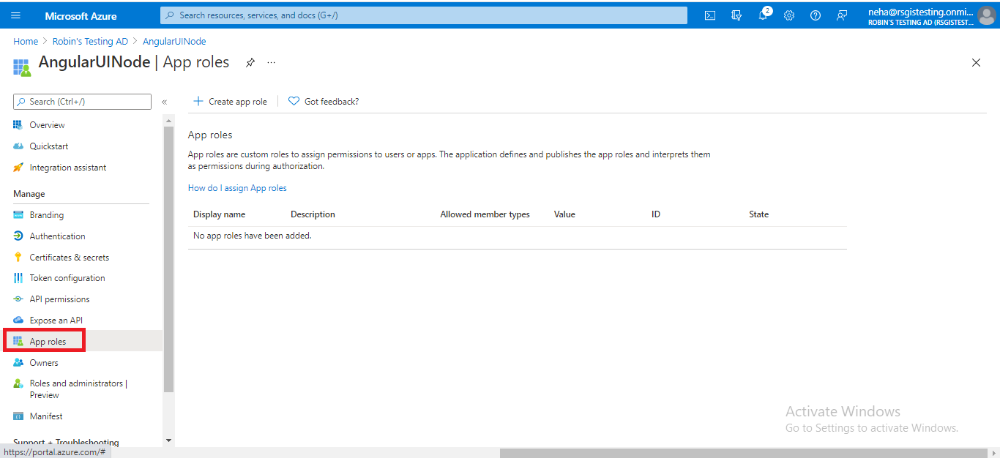
&nbsp;

2. Click on **Create app role**

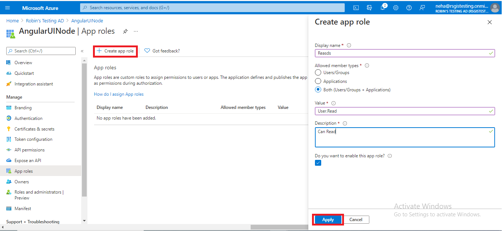
&nbsp;

3. Fill out **Form** inputs as follow:
- **Display name:** for the app role that appears in the admin consent and app assignment experiences
- **Allowed member types:** Specifies whether this app role can be assigned to users, applications, or both
- **Value:** Specifies the value of the roles claim that the application should expect in the token
- **Description** add description
4. Select Apply to save your changes

## Step 4: Add Scopes

1. Under Manage, select **Expose an API**


&nbsp;

2. Click on **Add a scope**

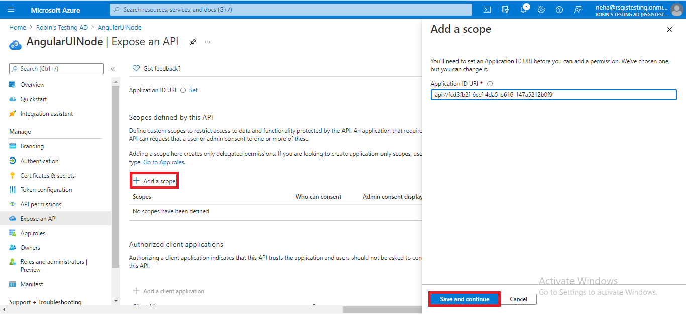
&nbsp;

3. You're prompted to set an **Application ID URI** if you haven't yet configured one

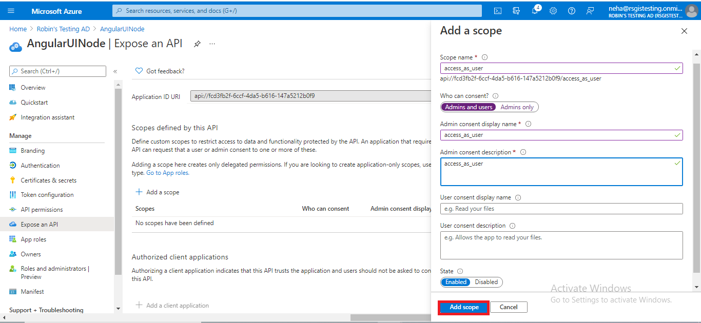
&nbsp;

4. Click on **Save and continue**
5. Next, specify the scope's attributes in the Add a scope pane

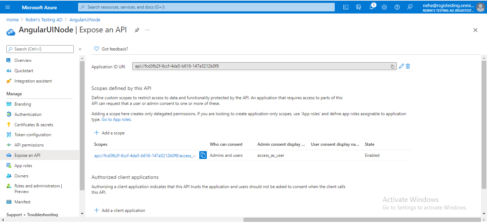
&nbsp;

6. Fill out **Form** inputs as follow:
- **Scope name:** The name of your scope. Here you add **access_as_user**
- **Who can consent:** select **Admins and users**
- **Admin consent display name:** A short description of the scope's purpose that only admins will see
- **Admin consent description:** add description

## To Run Locally
1. Clone the repository

      ```bash
      git clone https://github.com/RobinGhoshATL/vuejs-2-nodejs.git
      cd vuejs-2-nodejs 
      ```
2. Create new file with name `.env.local`. Copy all the content from `.env.local.sample` file and paste it in `.env.local` file.

3. Substitute `VUE_APP_CLIENT_ID` in `.env.local` file.
Get your `VUE_APP_CLIENT_ID` from your app registration in Azure Active Directory.
Substitute `VUE_APP_BACKEND_BASE_URL` as `https://nodejs-be-protected.azurewebsites.net/api/`.

      ```bash
     VUE_APP_CLIENT_ID="CHANGE_ME"
     VUE_APP_BACKEND_BASE_URL="CHANGE_ME"

      ```   
4. Run `npm install` in a terminal to install required npm modules

5. Run `npm run serve` in a terminal to start your vue.js application.  Navigate to `http://localhost:8080/`. If you change any of the source files, you should restart your application again.

CONGRATULATIONS. If you are redirect to Microsoft login page and after login redirect to dashboard page, you are successfully run this application locally.

## Build

Run `npm run build` to build the project. 
## Lint code with ESLint

Run `npm run lint`.

## Demo: When the app funtions correctly, after Azure AD login you should see the following screens

1. Dashboard

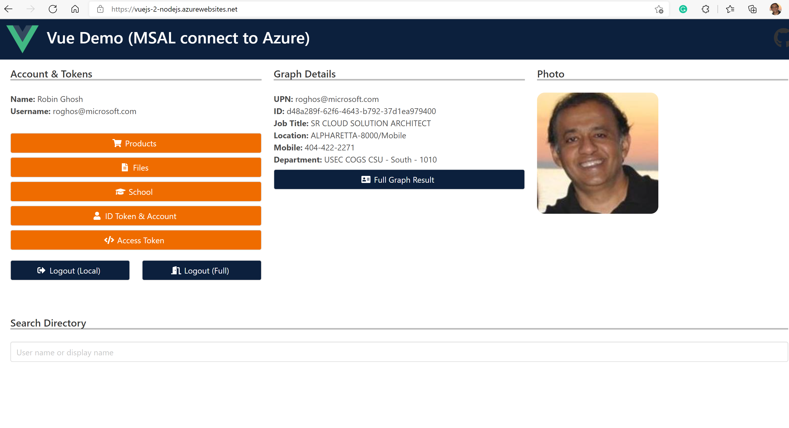
&nbsp;

2. Products

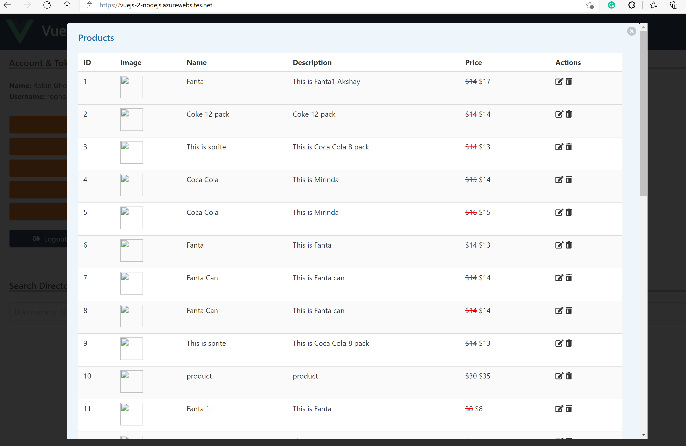
&nbsp;

3. Files

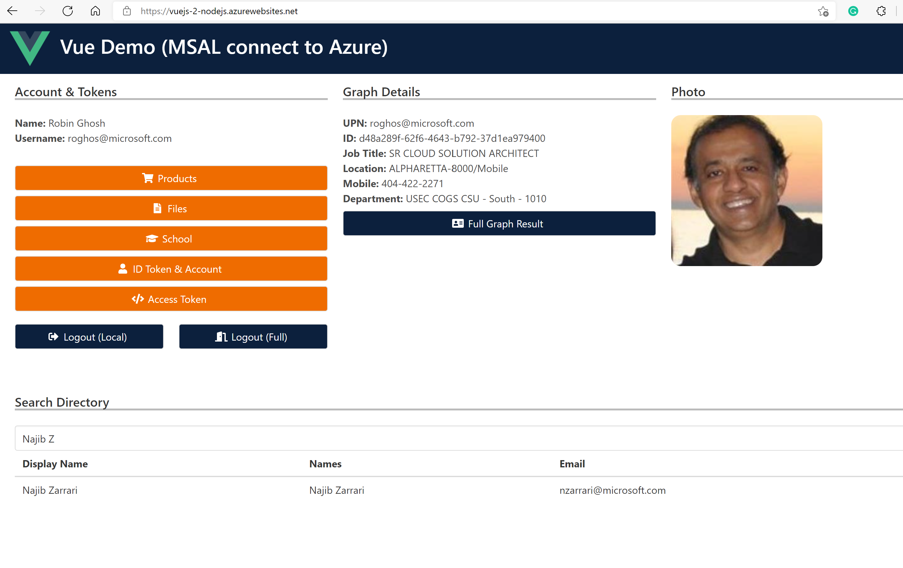
&nbsp;

4. School

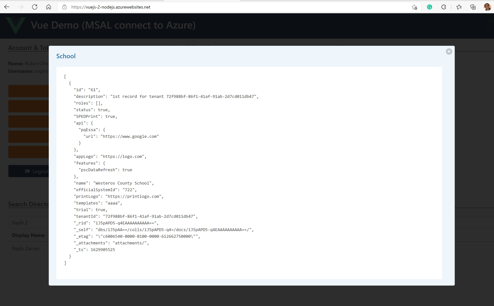
&nbsp;
